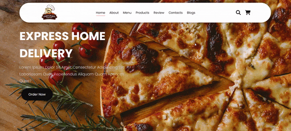

<h1> Food Catalog </h1>

Bu proje, HTML5, CSS3 ve fontawesome ikonları kullanılarak geliştirilmiş bir yemek menüsü web sitesidir. Proje, responsive (duyarlı) tasarım prensipleriyle oluşturulmuş olup, tüm cihazlarda uyumlu bir kullanıcı deneyimi sunmaktadır. Web sitesi; ürünler, hakkında, müşteri görüşleri, bloğumuz ve konum gibi bölümleri içermektedir. Şık ve modern bir tasarım hedeflenerek, kullanıcıların kolayca gezinebileceği bir yapı sağlanmıştır. Proje kodlarına repository bölümünde bulunan index dosyasından ulaşabilirsiniz

<h2> Ekran Görüntüsü </h2>

